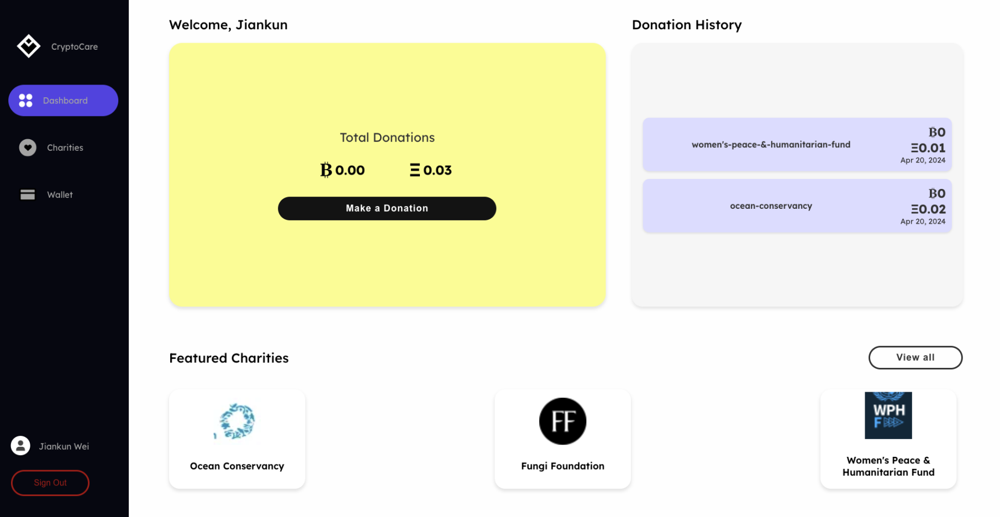
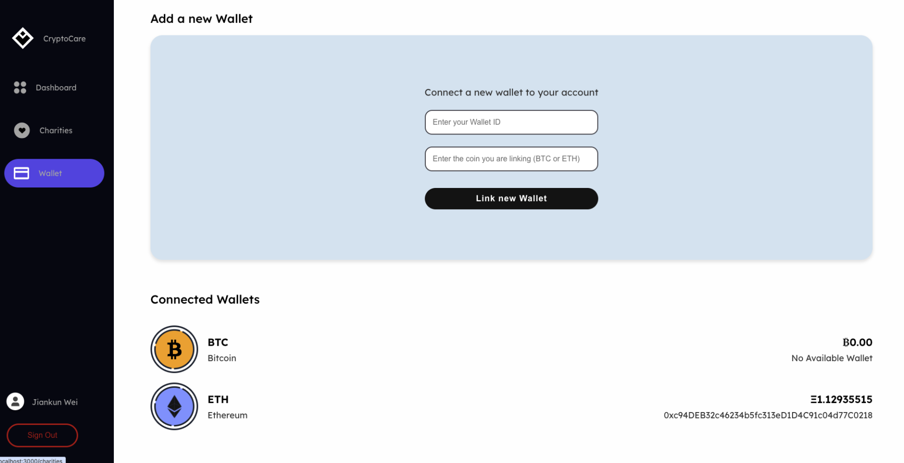
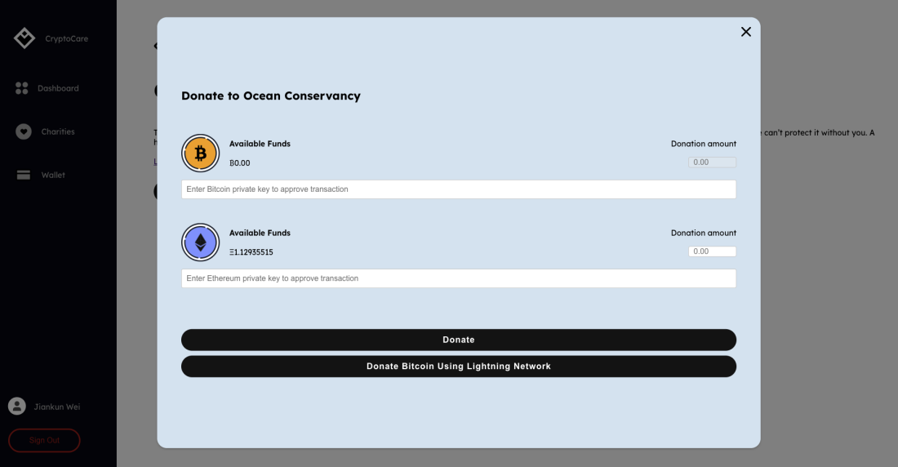

# Crypto Care

## Welcome to CryptoCare - Revolutionizing Charitable Giving with Blockchain Technology

CryptoCare is transforming the world of philanthropy by harnessing the power of blockchain technology. Our platform leverages Bitcoin and Ethereum to create a transparent, efficient, and decentralized donation system that minimizes administrative costs and eliminates the need for intermediaries.
<p align="center">
  <a href="#img1"></a>
  <a href="#img2"></a>
  <a href="#img3"></a>
</p>

## Key Features of CryptoCare:

Decentralized Donations: Directly connect with causes you care about. Your contributions go straight to the beneficiaries without any delays or unnecessary expenses.
Immutable Ledger: Every transaction is securely recorded on a public blockchain, ensuring that every donation is traceable from start to finish. This level of transparency builds trust and accountability, making your generosity completely transparent.
Anonymity and Security: Donate anonymously using pseudonymous addresses. At CryptoCare, we prioritize your privacy, allowing you to support your favorite causes without disclosing your identity.
User-Friendly Experience: With support for major cryptocurrencies like Bitcoin and Ethereum, our platform is designed for simplicity and ease of use, featuring low fees and instant transactions to facilitate your charitable activities.

## Youtube

<div align="center">
  <a href="https://www.youtube.com/watch?v=Mtdf4hMzg2s" title="Watch the video">
    
  </a>
</div>


#CryptoCare #BlockchainCharity #TransparentDonations #DecentralizedGiving #Bitcoin #Ethereum

## FireBase

In case of firebase project expiration, please:

- set up a new firebase project
- go to `frontend/src/components/FireBase/firebase.js` and modify the `firebaseConfig` to:

```javascript
const firebaseConfig = {
  apiKey: "Your-API-Key",
  authDomain: "your-auth-domain.firebaseapp.com",
  projectId: "your-project-id",
  storageBucket: "your-storage-bucket.appspot.com",
  messagingSenderId: "your-messaging-sender-id",
  appId: "your-app-id",
  measurementId: "your-measurement-id"
};

```

## Steps to run

- Clone the main repo

- navigate to `frontend` folder

- install the following

    - `npm install firebase`
    - `npm install react-scripts --save`
    - `npm install axios`
    - `npm install web3`
    - `npm install @fortawesome/fontawesome-free`
    - `npm install @fortawesome/react-fontawesome`
    - `npm install @fortawesome/free-solid-svg-icons`

- then `npm start`

- go to `http://localhost:3000`

- Enjoy!

## Directory Tree

```css
src/
├── components/
│   ├── Auth/
│   │   ├── Login/
│   │   │   ├── Login.css
│   │   │   └── Login.js
│   │   └── Register/
│   │       ├── Register.css
│   │       └── Register.js
│   ├── Button/
│   │   ├── Button.css
│   │   ├── LargeButton.js
│   │   ├── SmallButton.js
│   │   └── SmallStrokedButton.js
│   ├── Charities/
│   │   ├── CharityCard/
│   │   │   ├── CharityCard.css
│   │   │   └── CharityCard.js
│   │   ├── Data/
│   │   │   └── CharityData.js
│   │   ├── DonationForm/
│   │   │   ├── DonationCoinCard.js
│   │   │   ├── DonationForm.css
│   │   │   ├── DonationForm.js
│   │   │   └── transferCoin.js
│   │   ├── IndividualCharityPage/
│   │   │   ├── IndividualCharityPage.css
│   │   │   └── IndividualCharityPage.js
│   │   ├── Charities.css
│   │   └── Charities.js
│   ├── Dashboard/
│   │   ├── DonationHistory/
│   │   │   ├── DonationHistory.css
│   │   │   ├── DonationHistory.js
│   │   │   └── DonationHistoryEmptyCard.js
│   │   ├── Donations/
│   │   │   ├── Donations.css
│   │   │   └── Donations.js
│   │   ├── FeaturedCharities/
│   │   │   ├── FeaturedCharities.css
│   │   │   └── FeaturedCharities.js
│   │   ├── Dashboard.css
│   │   └── Dashboard.js
│   ├── FireBase/
│   │   └── firebase.js
│   ├── NavigationSideBar/
│   │   ├── NavbarLinks.js
│   │   ├── NavigationSidebar.css
│   │   └── NavigationSidebar.js
│   ├── Wallet/
│   │   ├── Assets/
│   │   │   ├── Assets.css
│   │   │   └── Assets.js
│   │   ├── LinkWalletCard/
│   │   │   ├── LinkWalletCard.css
│   │   │   └── LinkWalletCard.js
│   │   ├── WalletCard/
│   │   │   ├── WalletCard.css
│   │   │   └── WalletCard.js
│   │   ├── Wallet.css
│   │   └── Wallet.js
│   └── contexts/
│       └── UserContext.js
├── App.css
├── App.js
├── App.test.js
├── index.css
├── index.js
├── logo.svg
├── reportWebVitals.js
└── setupTests.js
```
