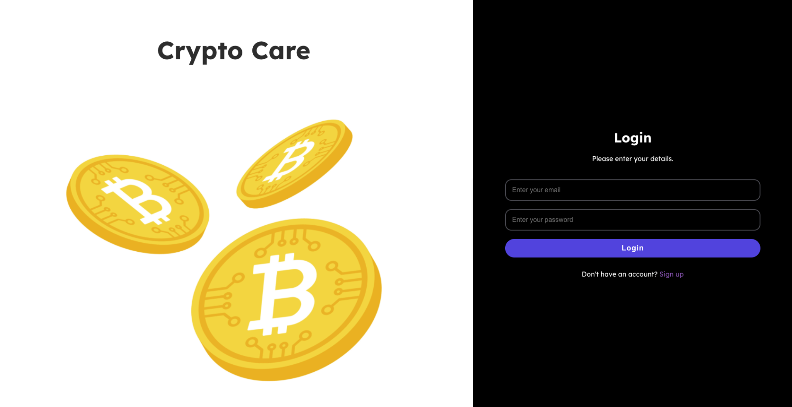

# Crypto Care

## Welcome to CryptoCare - Revolutionizing Charitable Giving with Blockchain Technology

CryptoCare is transforming the world of philanthropy by harnessing the power of blockchain technology. Our platform leverages Bitcoin and Ethereum to create a transparent, efficient, and decentralized donation system that minimizes administrative costs and eliminates the need for intermediaries.
<p align="center">
  <a href="#img1"></a>
  <a href="#img2"></a>
  <a href="#img3"></a>
</p>

## Table of Contents
- [Inspiration](#Inspiration)
- [What it does](#What-it-does)
- [How we built it](#How-we-built-it)
- [Youtube](#Youtube)
- [challenges](#Challenges)
- [What we learned](#What-we-learned)
- [Next Step](#What's-next-for-CryptoCare)
- [Devpost](#Devpost)
- [Firebase](#Firebase)
- [Run](#Steps-to-run)
- [Structure](#Directory-Tree)
- [License](#License)

## Inspiration

Our project draws inspiration from the pressing need for transparency and efficiency in charitable giving. Conventional donation channels frequently lack transparency, leaving donors uncertain about the destination and utilization of their funds. Motivated by the game-changing capabilities of blockchain technology, we are on a mission to transform philanthropy. Through harnessing the power of Bitcoin and Lightning Network payments, we are building a donation platform that is transparent, secure, and efficient. By enabling donors to track their contributions in real time and guaranteeing that each donation creates a measurable impact, our goal is to foster trust and ignite increased engagement in charitable endeavors.

## What it does

The project, CryptoCare, fundamentally transforms the landscape of charitable giving by utilizing the innovative capabilities of blockchain technology, specifically Bitcoin and Ethereum, to facilitate transparent and efficient donations.

At its core, CryptoCare provides a decentralized platform where donors can contribute directly to causes and recipients without the need for intermediaries. This decentralized model ensures that donations are efficiently channeled to their intended beneficiaries, minimizing administrative costs and delays.

Through the implementation of blockchain technology, every donation and transaction is recorded on an immutable public ledger, guaranteeing unprecedented transparency. Donors have real-time access to track the journey of their contributions, from the moment of donation to its utilization in the field. This transparency fosters trust and accountability, addressing the skepticism often associated with traditional donation channels.

Furthermore, CryptoCare prioritizes donor privacy by allowing contributions to be made anonymously using pseudonymous addresses. This ensures that donors can support causes without compromising their identity, fostering a safe and inclusive giving environment.

In addition to Bitcoin and Ethereum support, CryptoCare offers a seamless user experience with low fees and instant transactions. This user-centric approach aims to remove barriers to giving and encourage greater participation in philanthropy.

Overall, CryptoCare revolutionizes charitable giving by empowering donors to make informed decisions and witness the tangible impact of their contributions in real-time. By leveraging cryptocurrency and blockchain technology, CryptoCare sets a new standard for transparency, efficiency, and accountability in the charitable sector.

## How we built it

CryptoCare was developed using a blend of modern technologies and integrations to create a transparent, efficient, and user-friendly platform for charitable giving. React.js and JavaScript formed the foundation of the frontend development, with CSS for styling and Figma for design prototyping. Infura API facilitated Ethereum support, while Blockstream's API provided real-time Bitcoin balance and transaction data. Voltage was integrated for Lightning Network support, enabling fast and low-cost Bitcoin transactions. Web3.js served as the bridge between the frontend and Ethereum blockchain, enabling smart contract interactions. Metamask was seamlessly integrated for secure Ethereum wallet functionality. Together, these components enabled CryptoCare to offer a streamlined donation experience, empowering users to contribute to causes with confidence and transparency.


**Frontend** - React, JavaScript, CSS, Figma for designing Backend - JavaScript web3, infura api for Ethereum, blockstream to get bitcoin balance, voltage for bitcoin lightning network, metamask, firebase

## Youtube

<div align="center">
  <a href="https://www.youtube.com/watch?v=Mtdf4hMzg2s" title="Watch the video">
    
  </a>
</div>

## Challenges

During the development of CryptoCare, we encountered several challenges, particularly in designing the backend infrastructure and establishing connections with Ethereum and Bitcoin wallets, as well as integrating Bitcoin Lightning Network functionality. Initially, connecting to Ethereum and Bitcoin wallets posed a significant hurdle, requiring careful consideration of security measures and user experience. Additionally, implementing support for Bitcoin Lightning Network transactions presented technical complexities that required thorough research and experimentation to overcome. As the project evolved, we realized the necessity to restructure the architecture to ensure seamless communication between the backend and frontend components. This restructuring process involved optimizing data flow and streamlining API interactions to enhance overall performance and reliability. Despite these challenges, our team's perseverance and collaborative efforts enabled us to successfully address each obstacle, ultimately delivering a robust and innovative platform for transparent and efficient charitable giving.

## Accomplishments

We take immense pride in the accomplishments we've achieved with CryptoCare. Building the project from scratch was a monumental task, but it provided us with invaluable opportunities for growth and learning. Throughout the development process, we delved deep into various technologies and concepts, expanding our knowledge base and honing our skills. One of our key achievements is the successful implementation of a platform that facilitates anonymous donations while ensuring transparency and accountability. By leveraging blockchain technology and integrating with Ethereum and Bitcoin wallets, we've provided users with a secure and efficient means to contribute to charitable causes while maintaining their privacy. We're proud to have created a platform that not only empowers individuals to make a positive impact but also fosters trust and transparency within the charitable sector, ultimately driving positive change in communities around the world.

## What we learned

The development journey of CryptoCare has been a profound learning experience for our team. Firstly, we gained invaluable insights into integrating diverse technologies and APIs seamlessly. From connecting with Ethereum and Bitcoin wallets to implementing Lightning Network functionality, we honed our skills in navigating complex technical landscapes. Additionally, managing a distributed team across different time zones presented its own set of challenges and learnings. We discovered effective strategies for communication, collaboration, and task allocation to ensure smooth progress despite geographical barriers. This experience taught us the importance of clear communication channels and adaptable workflows to accommodate diverse schedules and time zones. Moreover, navigating the intricacies of team management proved to be a valuable lesson. From fostering a collaborative culture to resolving conflicts and motivating team members, we developed leadership and interpersonal skills essential for effective project execution. Overall, the journey of building CryptoCare has been a transformative one, equipping us with a diverse array of technical, managerial, and interpersonal skills. These lessons learned will undoubtedly inform and enrich our future endeavours, empowering us to tackle even greater challenges with confidence and resilience.

## What's next for CryptoCare

For future integration we are thinking of the following points:

- Integrate with more charities.
- Make a Gen-AI-powered chatbot to better help the user to decide about the charities.
- Include more cryptocurrency support.

## Devpost

This project was submitted to the **2024 MIT Bitcoin Hackathon: Scaling Up**.

For more details about the project and its contributions, you can view our submission on DevPost.

[Read more about CryptoCare on DevPost](https://devpost.com/software/cryptocare-ug6jbq?ref_content=user-portfolio&ref_feature=in_progress)

## FireBase

In case of firebase project expiration, please:

- set up a new Firebase project
- go to `frontend/src/components/FireBase/firebase.js` and modify the `firebaseConfig` to:

```javascript
const firebaseConfig = {
  apiKey: "Your-API-Key",
  authDomain: "your-auth-domain.firebaseapp.com",
  projectId: "your-project-id",
  storageBucket: "your-storage-bucket.appspot.com",
  messagingSenderId: "your-messaging-sender-id",
  appId: "your-app-id",
  measurementId: "your-measurement-id"
};

```

## Steps to run

- Clone the main repo

- navigate to `frontend` folder

- install the following

    - `npm install firebase`
    - `npm install react-scripts --save`
    - `npm install axios`
    - `npm install web3`
    - `npm install @fortawesome/fontawesome-free`
    - `npm install @fortawesome/react-fontawesome`
    - `npm install @fortawesome/free-solid-svg-icons`

- then `npm start`

- go to `http://localhost:3000`

- Enjoy!

## Directory Tree

```css
src/
├── components/
│   ├── Auth/
│   │   ├── Login/
│   │   │   ├── Login.css
│   │   │   └── Login.js
│   │   └── Register/
│   │       ├── Register.css
│   │       └── Register.js
│   ├── Button/
│   │   ├── Button.css
│   │   ├── LargeButton.js
│   │   ├── SmallButton.js
│   │   └── SmallStrokedButton.js
│   ├── Charities/
│   │   ├── CharityCard/
│   │   │   ├── CharityCard.css
│   │   │   └── CharityCard.js
│   │   ├── Data/
│   │   │   └── CharityData.js
│   │   ├── DonationForm/
│   │   │   ├── DonationCoinCard.js
│   │   │   ├── DonationForm.css
│   │   │   ├── DonationForm.js
│   │   │   └── transferCoin.js
│   │   ├── IndividualCharityPage/
│   │   │   ├── IndividualCharityPage.css
│   │   │   └── IndividualCharityPage.js
│   │   ├── Charities.css
│   │   └── Charities.js
│   ├── Dashboard/
│   │   ├── DonationHistory/
│   │   │   ├── DonationHistory.css
│   │   │   ├── DonationHistory.js
│   │   │   └── DonationHistoryEmptyCard.js
│   │   ├── Donations/
│   │   │   ├── Donations.css
│   │   │   └── Donations.js
│   │   ├── FeaturedCharities/
│   │   │   ├── FeaturedCharities.css
│   │   │   └── FeaturedCharities.js
│   │   ├── Dashboard.css
│   │   └── Dashboard.js
│   ├── FireBase/
│   │   └── firebase.js
│   ├── NavigationSideBar/
│   │   ├── NavbarLinks.js
│   │   ├── NavigationSidebar.css
│   │   └── NavigationSidebar.js
│   ├── Wallet/
│   │   ├── Assets/
│   │   │   ├── Assets.css
│   │   │   └── Assets.js
│   │   ├── LinkWalletCard/
│   │   │   ├── LinkWalletCard.css
│   │   │   └── LinkWalletCard.js
│   │   ├── WalletCard/
│   │   │   ├── WalletCard.css
│   │   │   └── WalletCard.js
│   │   ├── Wallet.css
│   │   └── Wallet.js
│   └── contexts/
│       └── UserContext.js
├── App.css
├── App.js
├── App.test.js
├── index.css
├── index.js
├── logo.svg
├── reportWebVitals.js
└── setupTests.js
```

## License

This project is open-sourced under the MIT License. For more details, see the [LICENSE](LICENSE) file in the repository.
